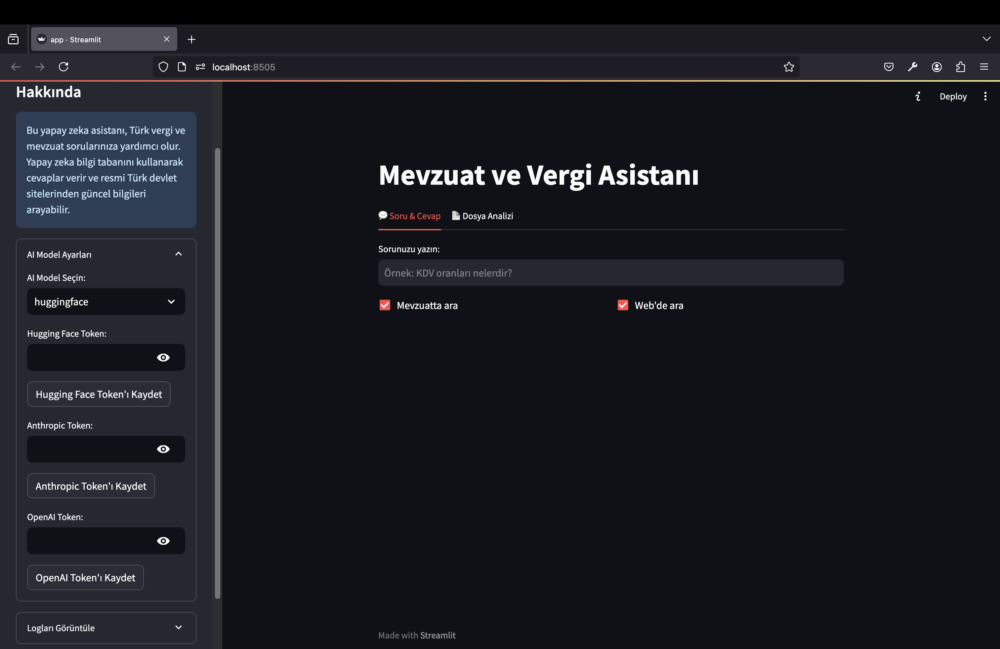

# GİB AI Asistan

Modern ve kullanıcı dostu arayüze sahip bir yapay zeka asistanı. Türk vergi mevzuatı ve beyanname süreçleri hakkında sorularınızı yanıtlar ve dosya analizleri yapar.

## 📸 Ekran Görüntüleri

### Ana Ekran


### Soru & Cevap


### Dosya Analizi


## ✨ Özellikler

- 💬 **Soru & Cevap**: Vergi ve mevzuat konularında sorularınızı yanıtlar
- 📄 **Dosya Analizi**: PDF ve XML dosyalarını analiz eder ve sorularınızı yanıtlar
- 🎯 **Çoklu AI Model Desteği**: HuggingFace (Mistral), Anthropic (Claude) ve OpenAI (GPT-4) modellerini destekler
- 🔄 **Kolay Model Geçişi**: Tek tıkla farklı AI modelleri arasında geçiş yapabilirsiniz
- 📱 **Responsive Tasarım**: Her ekran boyutuna uyumlu modern arayüz

## 🚀 Kurulum

1. Gerekli Python paketlerini yükleyin:
```bash
pip install -r requirements.txt
```

2. `.env` dosyası oluşturun ve API anahtarlarınızı ekleyin:
```env
HUGGING_FACE_TOKEN=your_token_here
ANTHROPIC_API_KEY=your_token_here
OPENAI_API_KEY=your_token_here
```

3. Uygulamayı çalıştırın:
```bash
streamlit run app.py
```

## 📖 Kullanım

1. Soldaki ayarlar menüsünden kullanmak istediğiniz AI modelini seçin
2. "Soru & Cevap" sekmesinde doğrudan soru sorabilirsiniz
3. "Dosya Analizi" sekmesinde PDF veya XML dosyası yükleyip analiz ettirebilirsiniz

## 🔧 Teknik Detaylar

- **Maksimum Dosya Boyutu**: 25MB
- **Desteklenen Dosya Formatları**: PDF, XML
- **Dil**: Python 3.8+
- **Ana Framework**: Streamlit

## 📄 Lisans

Bu proje MIT lisansı altında lisanslanmıştır. Detaylar için `LICENSE` dosyasına bakınız.
